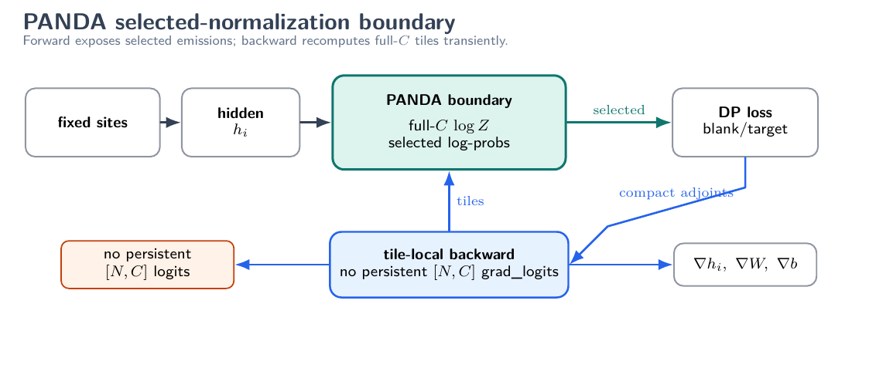
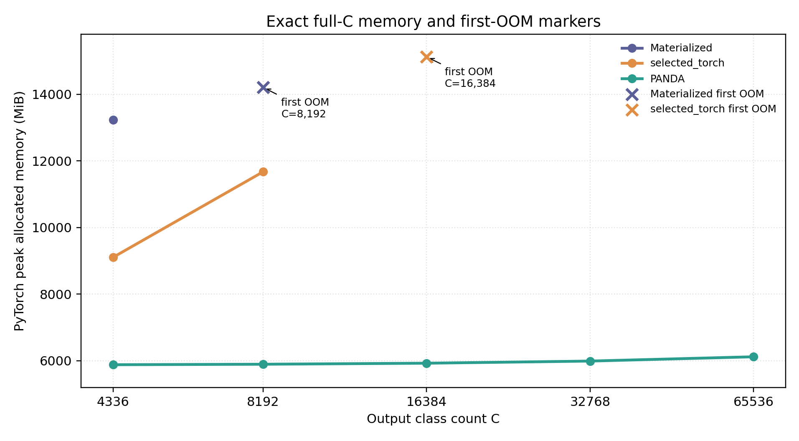
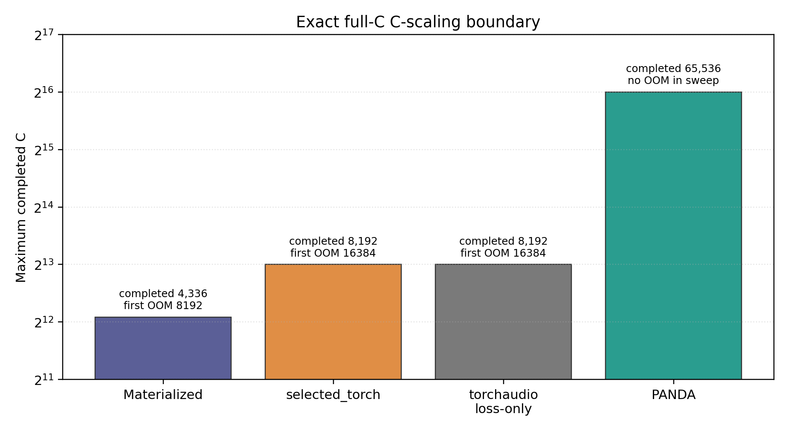
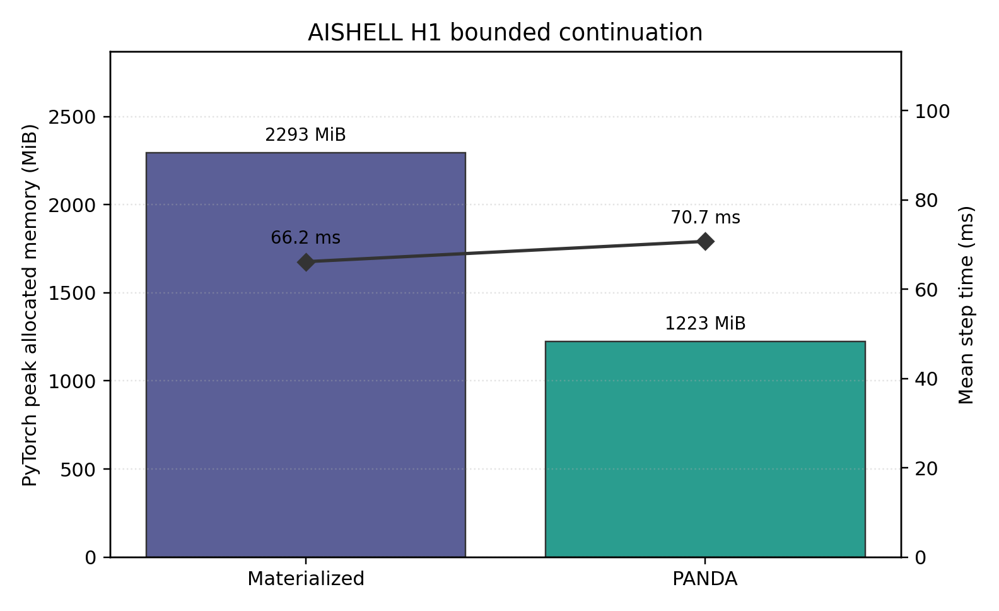
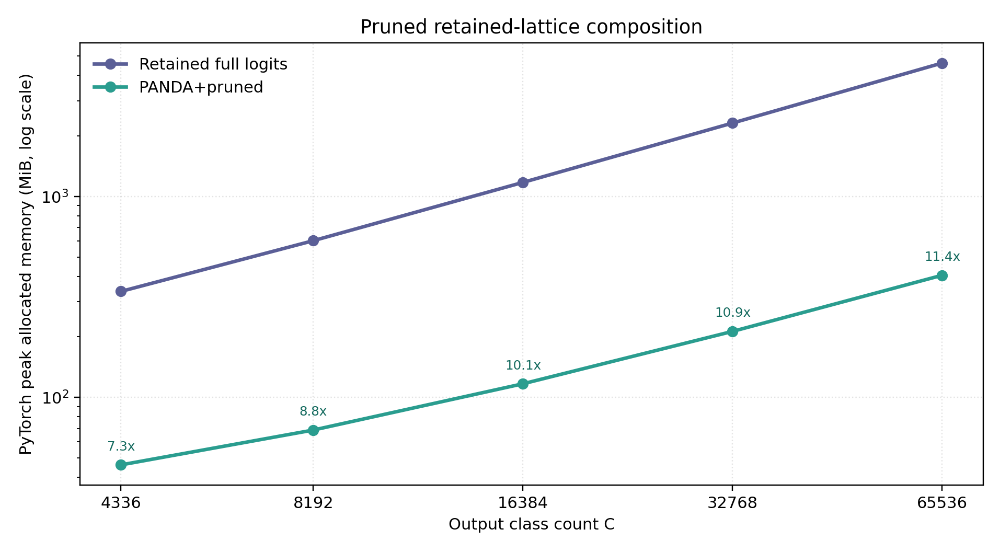

# PANDA

**Exact full-`C` selected normalization for transducer / RNN-T ASR training systems.**

[](https://www.python.org/)
[](https://pytorch.org/)
[](LICENSE)

PANDA is a small research prototype for the selected-normalizer boundary in
structured ASR losses. The point is simple:

> **RNN-T / transducer DP needs only selected blank/target emissions, but exact
> full-`C` normalization still needs the denominator over every output class.**

PANDA computes that full-`C` denominator exactly while avoiding persistent
`[N,C]` logits and full `grad_logits[N,C]`. Here `C` means output class count /
vocabulary size.

The repository is intentionally lightweight: it lets an external engineer run
the selected-normalizer mechanism on random tensors without cloning the full
research workspace.

---

## Key Findings

These are paper-level systems results, included here to explain why the boundary
is useful. The GitHub package does not re-run the full ASR experiments.

| Question | Evidence | Result | Interpretation |
|---|---|---:|---|
| Does full-logit materialization hit a `C` wall? | Same-machine exact full-`C` C-sweep | materialized first OOM at `C=8192` | persistent `[N,C]` state is the pressure point |
| Does selected normalization move that wall? | Same C-sweep | PANDA completes through `C=65536` | memory/OOM boundary moves along the output-class axis |
| Is this exact full-`C`, not sampled softmax? | Dense-oracle parity + paper derivation | selected log-probs / `logZ` / gradients match within small numeric tolerances | denominator remains exact over all classes |
| Does it enter real ASR training code? | AISHELL / WenetSpeech bounded routes | compute-loss / backward / bounded update contracts pass | integration evidence, not full-training ASR quality |
| Does it compose with Pruned RNN-T? | retained-site composition rows | pruned `N` reduction and PANDA per-site `C` materialization reduction compose | orthogonal memory axes |

**One-line takeaway:** PANDA isolates and removes a concrete materialization
barrier for exact full-`C` transducer experiments. It is a systems mechanism,
not an ASR accuracy recipe.

---

## Architecture

PANDA sits between fixed full or retained transducer sites and the standard
blank/target dynamic program. Forward exposes compact selected log-probabilities;
backward recomputes full-`C` tiles transiently and accumulates exact gradients.



The package boundary is:

```text
hidden_sites [N,H]
output_weight [C,H]
output_bias [C]
selected_ids [N,S_max]
selected_mask [N,S_max]
selected_adjoints [N,S_max]
  -> selected_logp [N,S_max], logZ [N],
     grad_hidden [N,H], grad_weight [C,H], grad_bias [C]
```

For standard transducer sites, `S_i={target_i, blank}`. Invalid target sites
omit the target selected entry and use zero target adjoint.

---

## Figures

These figures are copied from the paper artifact package. They summarize scoped
systems evidence and are not generated by the lightweight smoke tests.

| Exact full-`C` C-scaling / OOM boundary | Capacity ceiling |
|---|---|
|  |  |

| AISHELL bounded continuation memory / time | Pruned RNN-T composition |
|---|---|
|  |  |

The current public draft PDF is available at
[`paper/panda-draft.pdf`](paper/panda-draft.pdf). It is a draft reference, not
an accepted or proceedings version.

---

## Quickstart

Create a small smoke/test environment:

```bash
python -m venv .venv
. .venv/bin/activate
pip install -r requirements.txt
scripts/run_smoke.sh
```

Or install the test extra:

```bash
pip install -e ".[test]"
python -m pytest tests -q
```

CPU smoke tests work for small shapes. CUDA is only needed if you want PyTorch
peak allocated/reserved memory numbers.

Known-good local development stack while drafting:

```text
Python 3.10
PyTorch 2.10.0+cu130
CUDA build 13.0
```

Fresh package validation also passed on Python 3.12 with the current PyPI
`torch>=2.0` resolution using CPU smoke shapes.

---

## Smoke Output

The smoke scripts compare the PANDA path against a dense full-`C` PyTorch
autograd oracle. They print:

| Quantity | Meaning |
|---|---|
| selected log-probability max absolute error | forward selected-emission parity |
| `logZ` max absolute error | exact full-`C` denominator parity |
| loss absolute / relative error | compact selected-adjoint objective check |
| `grad_hidden`, `grad_weight`, `grad_bias` max_abs / rel_L2 / cosine | backward parity |
| PyTorch peak allocated/reserved MiB | CUDA memory smoke, when CUDA is available |
| `panda_persistent_full_logits=false` | no persistent full `[N,C]` logits |
| `panda_persistent_full_grad_logits=false` | no persistent full `grad_logits[N,C]` |

Representative local CUDA smoke snapshot:

| Smoke | Contract | `C` | Selected logp max abs | `logZ` max abs | Grad cosine | Persistent full logits | Persistent full `grad_logits` |
|---|---|---:|---:|---:|---:|---|---|
| `minimal_selected_normalizer_smoke.py` | blank/target selected set | 2048 | `9.54e-07` | `4.77e-07` | `1.0` | false | false |
| `multiselected_parity_smoke.py` | synthetic `|S_i|=3..5` selected set | 2048 | `9.54e-07` | `4.77e-07` | `1.0` | false | false |

---

## Repository Layout

```text
PANDA/
├── panda/
│   ├── selected_normalizer.py   # tiled exact full-C selected normalizer
│   ├── reference.py             # dense full-C oracle helpers
│   └── triton_kernels.py        # optional placeholder, not default backend
├── examples/
│   ├── minimal_selected_normalizer_smoke.py
│   └── multiselected_parity_smoke.py
├── tests/
│   └── test_selected_normalizer_parity.py
├── docs/
│   ├── method_boundary.md
│   ├── icefall_k2_integration_note.md
│   └── limitations.md
├── figures/                     # paper figures copied into the package
├── paper/
│   └── panda-draft.pdf
├── scripts/run_smoke.sh
├── pyproject.toml
├── environment.yml
└── requirements.txt
```

---

## What PANDA Is

For each site `i`, PANDA computes selected log-probabilities:

```text
logits_i[v] = h_i dot W[v] + b[v]
logZ_i = logsumexp_v logits_i[v] over all C classes
logp_i[s] = logits_i[s] - logZ_i for selected s in S_i
```

The denominator is exact over all `C` classes. The implementation scans `C` in
tiles and recomputes tile logits in backward. It never keeps persistent full
logits `[N,C]` or persistent full `grad_logits[N,C]`.

In an RNN-T or k2/icefall integration, PANDA belongs after the structured loss
or DP side has identified selected emissions and produced compact adjoints.
Recipe logic, tokenizer semantics, retained-site pruning, decoding, and WER/CER
evaluation remain outside this package.

See [`docs/method_boundary.md`](docs/method_boundary.md) and
[`docs/icefall_k2_integration_note.md`](docs/icefall_k2_integration_note.md).

---

## Scope

This package is **not** a production/default ASR backend. It does not claim:

- ASR quality improvement;
- WER/CER preservation beyond the bounded paper checks;
- full-training speedup;
- decode behavior;
- multi-hardware generality;
- sampled-softmax or approximate-denominator behavior;
- production multi-blank or TDT support.

The multi-selected example is a synthetic second-instance parity check for the
selected-set algebra, not production multi-blank support.

## License

Apache License 2.0. See [`LICENSE`](LICENSE).
