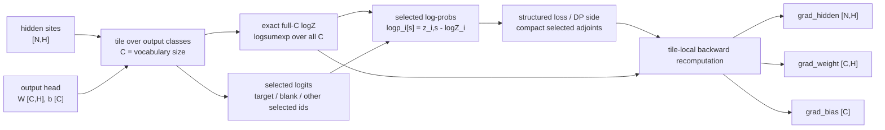

# PANDA

PANDA is a research prototype for exact full-`C` selected normalization at
structured-loss emission sites. Here `C` means output class count / vocabulary
size.

The code in this draft repository is deliberately small. It is meant to help an
external engineer understand and run the selected-normalizer boundary on random
tensors without cloning the full research workspace.

## What PANDA Is

For each site `i`, PANDA computes selected log-probabilities such as blank and
target emissions:

```text
logits_i[v] = h_i dot W[v] + b[v]
logZ_i = logsumexp_v logits_i[v] over all C classes
logp_i[s] = logits_i[s] - logZ_i for selected s in S_i
```

The denominator is exact over the full `C` classes. The smoke implementation
scans `C` in tiles and recomputes tile logits in backward. It does not keep
persistent full logits `[N,C]` and does not keep persistent full
`grad_logits[N,C]`.



This diagram is a boundary schematic. It is not a benchmark and it does not
claim a production/default backend.

## What PANDA Is Not

This package is not a production/default ASR backend. It does not claim ASR
quality, WER/CER preservation, full-training speedup, decode behavior, or
multi-hardware generality. It is not sampled softmax, NCE, or an approximate
denominator.

The current package also does not claim production multi-blank or TDT support.
The multi-selected example is a synthetic second-instance parity check for the
selected-set algebra.

## Quick Start

Create a small smoke/test environment:

```bash
python -m venv .venv
. .venv/bin/activate
pip install -r requirements.txt
scripts/run_smoke.sh
```

Use `python3` in place of `python` on systems that do not provide a `python`
launcher.

The package metadata also exposes equivalent extras:

```bash
pip install -e ".[test]"
```

If the current Python environment does not have `pytest`, the package smoke
environment installs it through `requirements.txt` or `.[test]`; until then,
`scripts/run_smoke.sh` falls back to the direct Python test runner.

Known-good development stack used while drafting this package:

```text
Python 3.10
PyTorch 2.10.0+cu130
CUDA build 13.0
```

Fresh package validation also passed on Python 3.12 with the current PyPI
`torch>=2.0` resolution (`torch 2.12.0+cu130`) using CPU smoke shapes.
Installing PyTorch from PyPI on Linux may download CUDA runtime wheels even for
CPU smoke tests; use a CPU-only PyTorch wheel/index if you need a smaller local
environment.

The examples also run on CPU for small shapes. CUDA is only needed if you want
PyTorch CUDA peak allocated/reserved memory numbers.

Triton is optional and is not part of the base smoke environment:

```bash
pip install -e ".[triton]"
```

The optional Triton boundary in this package is a placeholder for future
packaged kernels, not a production/default backend.

## Run Smoke

```bash
python examples/minimal_selected_normalizer_smoke.py
python examples/multiselected_parity_smoke.py
python -m pytest tests -q
```

or:

```bash
scripts/run_smoke.sh
```

## Expected Output

The smoke scripts print:

- selected log-probability max absolute error;
- `logZ` max absolute error;
- loss absolute/relative error;
- `grad_hidden`, `grad_weight`, and `grad_bias` max_abs / rel_L2 / cosine;
- PyTorch peak allocated/reserved MiB when CUDA is available;
- `panda_persistent_full_logits=false`;
- `panda_persistent_full_grad_logits=false`.

The dense oracle intentionally materializes `[N,C]` logits and uses PyTorch
autograd. The PANDA path uses tile-local logits and a manual compact-adjoint
backward.

### Smoke Result Snapshot

These are representative small-shape parity checks from the package smoke
scripts. They are correctness smoke tests, not ASR training, decode, speed, or
multi-hardware measurements.

| Smoke | Contract | Device in local run | `C` | Selected logp max abs | `logZ` max abs | Grad cosine | Persistent full logits | Persistent full `grad_logits` |
|---|---|---:|---:|---:|---:|---:|---|---|
| `minimal_selected_normalizer_smoke.py` | blank/target selected set | CUDA | 2048 | `9.54e-07` | `4.77e-07` | `1.0` | false | false |
| `multiselected_parity_smoke.py` | synthetic `|S_i|=3..5` selected set | CUDA | 2048 | `9.54e-07` | `4.77e-07` | `1.0` | false | false |

## Method Boundary

The package boundary is:

```text
hidden_sites [N,H]
output_weight [C,H]
output_bias [C]
selected_ids [N,S_max]
selected_mask [N,S_max]
selected_adjoints [N,S_max]
  -> selected_logp [N,S_max], logZ [N],
     grad_hidden [N,H], grad_weight [C,H], grad_bias [C]
```

Here the selected-entry width is a compact per-site dimension, not vocabulary
size and not a sampled-softmax sampled count. The output class count is always
`C`.

For standard RNN-T-style sites, `S_i={target_i, blank}`. Invalid target sites
are omitted from the target selected entry and should have zero target adjoint.

For synthetic multi-selected sites, `|S_i|` can be greater than 2. Selected
classes must be distinct within a site.

## Integration Note

In an RNN-T or k2/icefall integration, PANDA belongs at the selected-emission
normalizer boundary after the structured loss or DP side has identified selected
emissions and produced compact adjoints. Recipe logic, tokenizer semantics,
retained-site pruning, decoding, and WER/CER evaluation remain outside this
package.

See `docs/icefall_k2_integration_note.md` for a scoped integration sketch.

## License

This package is released under the Apache License 2.0. See `LICENSE`.
